# Description of L2 project launcher contracts

> This article explains the development of a project launcher contract for Layer 2. The developed contract generates project tokens in L1 and distributes the generated tokens to the vault in Layer2, allowing Layer2 to use project funds according to the planned schedule.


## Overall contracts

In L1, there are L1ProjectManager and L1TokenFactory contracts, and in L2, it consists of L2ProkjectManager and L2TokenFactory. And in L2, there are various vault contracts (Public Sale Vault, InitializeLiquidity Vault, Reward Vault For LP Vault, AirdropToStosHolder Vault, AirdropToTONStaker Vault, CustomA Vault, CustomB Vault) that hold the tokens of projects.

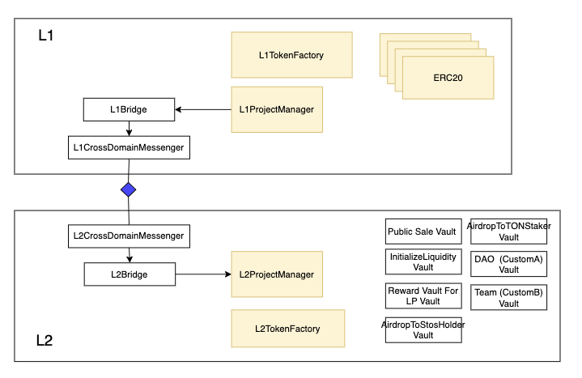

## USE CASE

### Create an L1 project and create a project token (createProject)

In L1, the user executes “create project” using the createProject function in the L1ProjectManager contract. When this function is executed, a project is created, an L1 project token is created, and the project ID and token address are sent as an event.

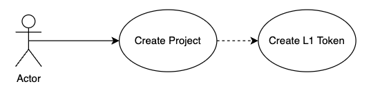

### Create L2 project token (createL2Token)

You must create an L2 project token that maps to the L1 project token created by project creation in L1.

Use the createL2Token function in the L2's L2TokenFactory contract to create an L2 project token that is mapped to the L1 project token.

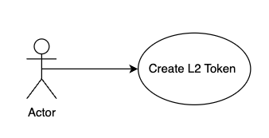

### L2 project launch (launchProject)

Project launching is the function of issuing L1 project tokens and distributing L2 project tokens to L2 vault.

After all project tokens have been created in L1 and L2, L1 project tokens can be minted and distributed to each vault in L2 according to a pre-designed token distribution plan.

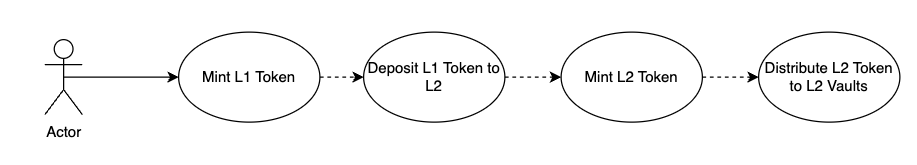

## Sequence diagram

### Create a project (createProject)

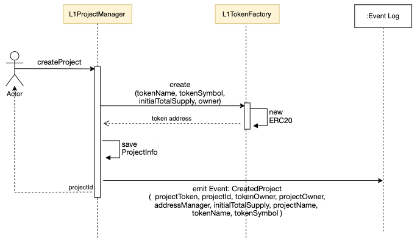


### Create L2 project token (createL2Token)

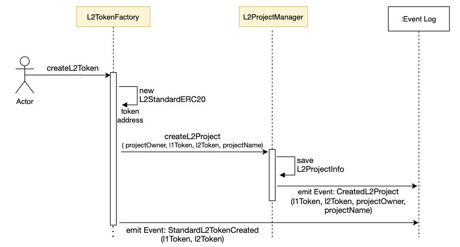


### L2 project launch (launchProject)

#### L1 Side

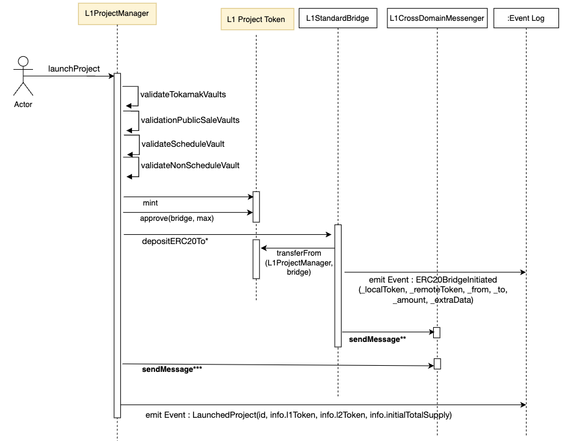

#### L2 Side: Operation after sendMessage** function of L1

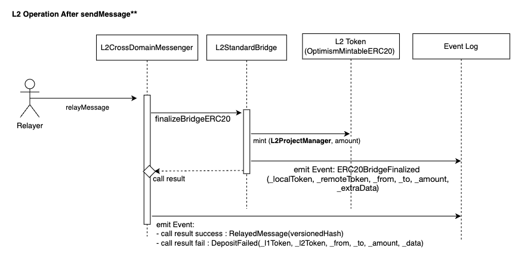


#### L2 Side: Operation after sendMessage*** function of L1

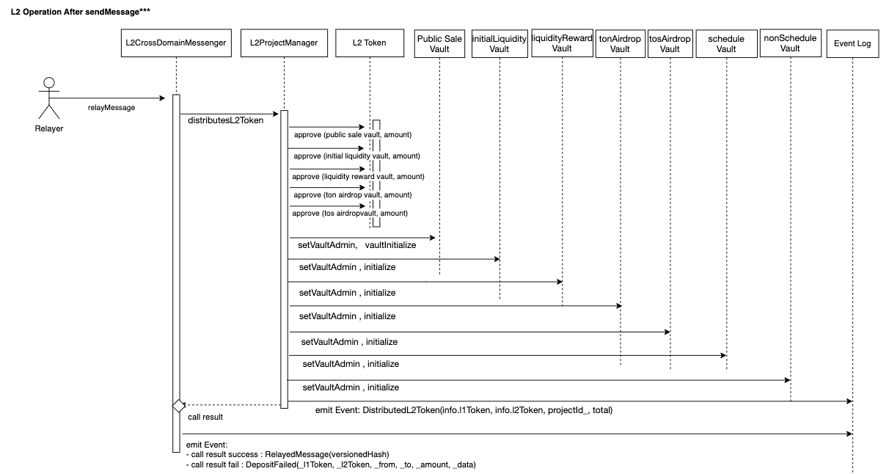


## Specifications for each contract

### L1TokenFactory

This is a factory that creates L1 tokens.

For L1 tokens, the token factory that creates the token differs depending on the token characteristics.

L1ProjectManager uses this factory to generate L1 tokens.

#### Token Factory Type

- L1ERC20A_TokenFactory
  - A token factory that creates L1ERC20A tokens
  - L1ERC20A
    - non-mint able token
    - ApproveAndCall
- L1ERC20B_TokenFactory
  - A token factory that creates L1ERC20B tokens
  - L1ERC20B
    - mint able token
    - ApproveAndCall
- L1ERC20C_TokenFactory
  - A token factory that creates L1ERC20C tokens
  - L1ERC20C
    - non-mint able token
    - ApproveAndCall
    - snapshot able
- L1ERC20D_TokenFactory
  - A token factory that creates L1ERC20D tokens
  - L1ERC20D
    - mint able token
    - ApproveAndCall
    - snapshot able

#### Events

```jsx
    event CreatedERC20A(address contractAddress, string name, string symbol, uint256 initialSupply, address to);

    event CreatedERC20B(address contractAddress, string name, string symbol, uint256 initialSupply, address owner);

    event CreatedERC20C(address contractAddress, string name, string symbol, uint256 initialSupply, address to);

    event CreatedERC20D(address contractAddress, string name, string symbol, uint256 initialSupply, address owner);
```

#### Functions

- create

  parameters : name, symbol, initialSupply, owner

  ```jsx
  function create(
          string calldata name,
          string calldata symbol,
          uint256 initialSupply,
          address owner
      ) external override virtual returns (address);
  ```


### L1ProjectManager

This is a contract used when creating the project in L1, which creates the project and issues L1 token.

#### Storage

```jsx
enum TOKEN_TYPE {
      ERC20_A,
      ERC20_B,
      ERC20_C,
      ERC20_D,
      NONE
  }

  enum L2_TYPE {
      TOKAMAL_OPTIMISM,
      TOKAMAL_ZKEVM,
      NONE
  }

  struct ProjectInfo {
      address projectOwner;
      address tokenOwner;
      address l1Token;
      address l2Token;
      address addressManager;
      uint256 initialTotalSupply;
      uint8 tokenType;
      uint8 l2Type;
      string projectName;
  }

struct L2Info {
        address l2TokenFactory;
        address l2ProjectManager;
        uint32 depositMinGasLimit;
        uint32 sendMsgMinGasLimit;
    }

struct TokamakVaults {
        InitalParameterPublicSale publicSaleParams;
        InitalParameterInitialLiquidityVault initialVaultParams;
        InitalParameterLiquidityRewardVault rewardTonTosPoolParams;
        InitalParameterLiquidityRewardVault rewardProjectTosPoolParams;
        InitalParameterScheduleVault tosAirdropParams;
        InitalParameterScheduleVault tonAirdropParams;
    }

struct InitalParameterPublicSale {
        InitalParameterPublicSaleVault vaultParams;
        InitalParameterPublicSaleClaim claimParams;
        InitalParameterVestingFundVault vestingParma;
    }
~~~~
struct InitalParameterPublicSaleVault {
      uint256 stosTier1;
      uint256 stosTier2;
      uint256 stosTier3;
      uint256 stosTier4;
      uint256 tier1Percents;
      uint256 tier2Percents;
      uint256 tier3Percents;
      uint256 tier4Percents;
      uint256 total1roundSaleAmount;
      uint256 total2roundSaleAmount;
      uint256 saleTokenPrice;
      uint256 payTokenPrice;
      uint256 hardcapAmount;
      uint256 changeTOSPercent;
      uint256 startWhiteTime;
      uint256 endWhiteTime;
      uint256 start1roundTime;
      uint256 end1roundTime;
      uint256 snapshotTime;
      uint256 start2roundTime;
      uint256 end2roundTime;
  }

  struct InitalParameterPublicSaleClaim {
      uint256 claimCounts;
      uint256 firstClaimPercent;
      uint256 firstClaimTime;
      uint256 secondClaimTime;
      uint256 roundInterval;
  }

  struct InitalParameterVestingFundVault {
      address receiveAddress;
      uint256 totalClaimCount;
      uint256 firstClaimPercent;
      uint256 firstClaimTime;
      uint256 secondClaimTime;
      uint256 roundIntervalTime;
      uint24 fee;
  }

struct InitalParameterInitialLiquidityVault {
    uint256 totalAllocatedAmount;
    uint256 tosPrice;
    uint256 tokenPrice;
    uint256 initSqrtPrice;
    uint256 startTime;
    uint16 fee;
}

struct InitalParameterLiquidityRewardVault {
    LibPool.PoolInfo poolParams;
    InitalParameterScheduleVault params;
}

struct InitalParameterScheduleVault {
    uint256 totalAllocatedAmount;
    uint256 totalClaimCount;
    uint256 firstClaimAmount;
    uint32 firstClaimTime;
    uint32 secondClaimTime;
    uint32 roundIntervalTime;
}

struct InitalParameterNonScheduleVault {
    uint256 totalAllocatedAmount;
}
uint256 public projectCount;

// TOKEN_TYPE - l1TokenFactory
mapping(uint8 => address) public l1TokenFactory;

// projectIndex - ProjectInfo
mapping(uint256 => LibProject.ProjectInfo) public projects;

// l1TokenAddress - projectIndex
mapping(address => uint256) public projectTokens;

// l2type - l2TokenFactory
mapping(uint8 => LibProject.L2Info) public l2Info;
```


#### Functions

- createProject

  - create project
  - return project id
  - you should get the project Id from CreatedProject event.

  ```solidity
  function createProject(
          address tokenOwner,
          address projectOwner,
          address addressManager,
          uint256 initialTotalSupply,
          uint8 tokenType,
          string memory projectName,
          string memory tokenName,
          string memory tokenSymbol
  ) external returns (uint256)

  event CreatedProject(
          address l1Token,
          uint256 projectId,
          address tokenOwner,
          address projectOwner,
          address addressManager,
          uint256 initialTotalSupply,
          string projectName, string tokenName, string tokenSymbol);
  ```

- launchProject

  - Register L2 Token
  - mint L1 Token
  - L1Token deposit To L2
  - distribute L2 Token  to L2 Vaults on L2  and initialize Vaults

  ```solidity
  function launchProject(
    uint256 projectId,
    address l2Token,
    uint256 totalAmount,
    LibProject.TokamakVaults memory tokamakVaults,
    LibProject.InitalParameterSchedule[] memory customScheduleVaults,
    LibProject.InitalParameterNonScheduleVault[] memory customNonScheduleVaults
  ) external

  event LaunchedProject(
          uint256 projectId,
          address l1Token,
          address l2Token,
          uint256 totalAmount);
  ```


#### The initial setting values of vaults

The parameters for the initial setting for each vault are as follows.

1. PublicSaleVault parameters

   ```jsx
   struct InitalParameterPublicSale {
       InitalParameterPublicSaleVault vaultParams;
       InitalParameterPublicSaleClaim claimParams;
   		InitalParameterVestingVault *vestingParams; //아직 추가안됨 됨*
   }

   struct InitalParameterPublicSaleVault {
       uint256 stosTier1;
       uint256 stosTier2;
       uint256 stosTier3;
       uint256 stosTier4;
       uint256 tier1Percents;
       uint256 tier2Percents;
       uint256 tier3Percents;
       uint256 tier4Percents;
       uint256 total1roundSaleAmount;
       uint256 total2roundSaleAmount;
       uint256 saleTokenPrice;
       uint256 payTokenPrice;
       uint256 hardcapAmount;
       uint256 changeTOSPercent;
       uint256 startWhiteTime;
       uint256 endWhiteTime;
       uint256 start1roundTime;
       uint256 end1roundTime;
       uint256 snapshotTime;
       uint256 start2roundTime;
       uint256 end2roundTime;
   }

   struct InitalParameterPublicSaleClaim {
   		uint256 claimCounts;
       uint256 firstClaimPercent;
       uint256 firstClaimTime;
       uint256 secondClaimTime
       uint256 roundInterval;
   }

   struct InitalParameterVestingVault {
   		address l2token;
   		address receivedAddress;
   		uint256 claimCounts;
       uint256 firstClaimPercent;
       uint256 firstClaimTime;
       uint256 secondClaimTime
       uint256 roundInterval;
   		uint24 poolFee;
   }

   //totalAllocatedAmount = tokamakVaults.publicSaleParams.total1roundSaleAmount+tokamakVaults.publicSaleParams.total2roundSaleAmount
   ```

2. InitialLiquidityVault parameters

   ```jsx
   struct InitalParameterInitialLiquidityVault {
           uint256 totalAllocatedAmount;
           uint256 tosPrice;
           uint256 tokenPrice;
           uint256 initSqrtPrice;
           uint256 startTime;
           uint16 fee;
       }
   ```

3. LpRewardVault  parameters

   ```jsx
   struct InitalParameterLiquidityRewardVault {
           LibPool.PoolInfo poolParams;
           InitalParameterScheduleVault params;
       }

   struct PoolInfo {
           address token0;
           address token1;
           uint24 fee;
       }

   struct InitalParameterScheduleVault {
           uint256 totalAllocatedAmount;
           uint256 totalClaimCount;
           uint256 firstClaimAmount;
           uint32 firstClaimTime;
           uint32 secondClaimTime;
           uint32 roundIntervalTime;
       }
   ```

4. TonAirdropVault parameters

   ```jsx
   struct InitalParameterScheduleVault {
           uint256 totalAllocatedAmount;
           uint256 totalClaimCount;
           uint256 firstClaimAmount;
           uint32 firstClaimTime;
           uint32 secondClaimTime;
           uint32 roundIntervalTime;
       }
   ```

5. TosAirdropVault parameters

   ```jsx
   struct InitalParameterScheduleVault {
           uint256 totalAllocatedAmount;
           uint256 totalClaimCount;
           uint256 firstClaimAmount;
           uint32 firstClaimTime;
           uint32 secondClaimTime;
           uint32 roundIntervalTime;
       }
   ```

6. customNonScheduleVaults : Vaults without a schedule, such as DAO vault

   ```jsx
   struct InitalParameterNonScheduleVault {
           uint256 totalAllocatedAmount;
       }
   ```

7. customScheduleVaults : vaults with schedule

   ```jsx
   struct InitalParameterScheduleVault {
           uint256 totalAllocatedAmount;
           uint256 totalClaimCount;
           uint256 firstClaimAmount;
           uint32 firstClaimTime;
           uint32 secondClaimTime;
           uint32 roundIntervalTime;
       }
   ```


#### Validation parameters of vaults

You must check parameters validation before executing. [sample](https://github.com/tokamak-network/l2-project-launch/blob/714459cf9fd452482d10c07c6f258743b149980a/test/2.L1ProjectManager.spec.ts#L712-L720)

```jsx
// validation check
let validationVaultsParameters = await deployed.l1ProjectManager.validationVaultsParameters(
    projectInfo.initialTotalSupply,
    tokamakVaults,
    customScheduleVaults,
    customNonScheduleVaults
)

expect(validationVaultsParameters.valid).to.be.eq(true)
```


### L2TokenFactory

Create L2 Token and Register Project Information.

#### Storage

```jsx
address public l2ProjectManager;
```

#### Event

```jsx
event StandardL2TokenCreated(address indexed l1Token, address indexed l2Token);
```

#### Function

- createL2Token

  Create L2 Token and register L2 project

  ```solidity
  function createL2Token(
          address projectOwner,
          address _l1Token,
          string calldata _name,
          string calldata _symbol,
          string calldata projectName
      ) external
  ```


### L2ProjectManager

Register Project by L2TokenFactory.

Distribute L2Token  to Vaults by L2CrossDomainMessage.

#### Storage

```jsx
address public l1ProjectManager;
address public l2TokenFactory;
address public l2CrossDomainMessenger;

address public publicSaleVault;
address public initialLiquidityVault;
address public liquidityRewardVault;
address public tonAirdropVault;
address public tosAirdropVault;

address public scheduleVault; // customScheduleVault
address public nonScheduleVault;    // customNonScheduleVault

// l2token - L2ProjectInfo
mapping(address => LibProject.L2ProjectInfo) public projects;

// l1token - l2token
mapping(address => address) public tokenMaps;

}
```

- L2ProjectInfo

```jsx
struct L2ProjectInfo {
        uint256 projectId;
        address projectOwner;
        address l1Token;
        address l2Token;
        string projectName;
    }

<https://github.com/tokamak-network/l2-project-launch/blob/apply-public-vault/contracts/libraries/LibProject.sol>
```

#### Event

```jsx
event CreatedL2Project(address indexed l1Token, address indexed l2Token, address projectOwner, string projectName);
```

#### Functions

- createL2Project

  Create Project on L2 by L2TokenFactory.

  ```
  function createL2Project(
          address projectOwner,
          address l1Token,
          address l2Token,
          string calldata projectName
      ) external

  emit CreatedL2Project(l1Token, l2Token, projectOwner, projectName);
  ```

- distributesL2Token

  Distribute L2Token on L2 by L2 crossDomainMessenger  triggered by L1ProjectManager

  ```
  function distributesL2Token(
          address l1Token,
          address l2Token,
          uint256 projectId,
          uint256 totalAmount,
          LibProject.TokamakVaults memory tokamakVaults,
          LibProject.InitalParameterScheduleVault[] memory customScheduleVaults,
          LibProject.InitalParameterNonScheduleVault[] memory customNonScheduleVaults
      )

  emit TokamakAllocatedAmount(
      projectId, l2Token,
      tokamakVaults.publicSaleParams.totalAllocatedAmount,
      tokamakVaults.initialVaultParams.totalAllocatedAmount,
      tokamakVaults.rewardParams.params.totalAllocatedAmount,
      tokamakVaults.tosAirdropParams.totalAllocatedAmount,
      tokamakVaults.tonAirdropParams.totalAllocatedAmount
  );

  emit DistributedL2Token(l1Token, l2Token, projectId, totalAmount, tokamakVaults, customScheduleVaults, customNonScheduleVaults);
  ```

- claimAll

  ```solidity
  function claimAll(
          address l2Token,
          string[] memory scheduleVaultNames
  ) external
  ```

  This function allows the user to claim all the vaults that need to be claimed at once, instead of claiming them individually. It enhances the user experience and simplifies the process of claiming vaults in the L2ProjectManager contract.

  - The contracts and functions executed in Logic are as follows.
    - claim of rewardVault[tos-l2token pool]
    - claim of rewardVault[wton-tos pool]
    - claim of tonAirdropVault
    - claim of tosAirdropVault
  - example : [link](https://github.com/tokamak-network/l2-project-launch/blob/3307c546a27b9a74642269d285f41b41d2c92fc6/test/2.L1ProjectManager.spec.ts#L1006-L1008)

- availableClaimAll

  ```solidity
  function availableClaimAll(
          address l2Token,
          string[] memory scheduleVaultNames
  ) public view returns (bool)
  ```

  - This is a function that checks if there is actually anything to execute in the function. Returns true when there is a claim to execute.
  - example : [link](https://github.com/tokamak-network/l2-project-launch/blob/3307c546a27b9a74642269d285f41b41d2c92fc6/test/2.L1ProjectManager.spec.ts#L954-L968)


### L2PublicSale

This is the L2Token sales registration setup process related to PublicSale.

#### Setting function called by L2projectManager

- **setVaultAdmin**

  Register L2Token and L2VaultAdmin in L2ProjectManager Contract.

  - L2Token Address

  - L2VaultAdmin Address

    ```jsx
    await l2PublicProxy.connect(l2ProjectManager).setVaultAdmin(
        address,
        l2vaultAdminAddress
    )
    ```

- **vaultInitialize**

  Initialize PublicSaleVault in L2ProjectManager. At this point, the L2Token is moved to PublicSaleVault.

  - publicSaleParams.vaultParams

  - publicSaleParams.claimParams

  - publicSaleParams.vestingParams

    ```jsx
    vaultParams = {
    	stosTier1:
    	stosTier2:
    	stosTier3:
    	stosTier4:
    	tier1Percents:
    	tier2Percents:
    	tier3Percents:
    	tier4Percents:
    	total1roundSaleAmount:
    	total2roundSaleAmount:
    	saleTokenPrice:
    	payTokenPrice:
    	hardcapAmount:
    	changeTOSPercent:
    	startWhiteTime:
    	endWhiteTime:
    	start1roundTime:
    	end1roundTime:
    	snapshotTime:
    	start2roundTime:
    	end2roundTime:
    }

    claimParams = {
    	claimCounts:
      firstClaimPercent:
      firstClaimTime:
      secondClaimTime:
      roundInterval:
    }

    vestingParams = {
    	receiveAddr:
      claimCounts:
      firstClaimPercent:
      firstClaimTime:
      secondClaimTime:
      roundInterval:
      fee:
    }
    ```

  - example git

    1. https://github.com/tokamak-network/l2-project-launch/blob/L2_PublicSale/test/shared/vaultParameters.ts#L6-L92

#### Public sale interfaces

- Token :

  ```jsx
  await l2Token.balanceOf(PublicSaleProxyAddress)
  ```

- Public Round 1 :

  ```jsx
  let manageInfo = await deployed.l2PublicProxy.manageInfo(l2Token.address)
  PublicRound1 : manageInfo.set1rdTokenAmount
  ```

- Public Round 2 :

  ```jsx
  let manageInfo = await deployed.l2PublicProxy.manageInfo(l2Token.address)
  PublicRound2 : manageInfo.set2rdTokenAmount
  ```

- Token Allocation for Liquidity Pool : ?

- Minimum Fund Raising Amount :

  ```jsx
  let manageInfo = await deployed.l2PublicProxy.manageInfo(l2Token.address)
  Minimum Fund Amount : manageInfo.hardCap
  ```

- Vault Admin Address :

  ```jsx
  await deployed.l2PublicProxy.vaultAdminOfToken(l2Token.address)
  ```

- Vault Contract Address :

  ```jsx
  VestingFundProxy Address
  (This is an immutable value that will be determined after deployment.)
  ```

- Address for receiving funds :

  ```jsx
  await deployed.l2VestingFundProxy.receivedAddress(l2Token.address)
  ```

- snapshot :

  ```jsx
  await deployed.l2PublicProxy.timeInfo(l2Token.address)
  snapshot : timeInfo.snapshot
  ```

- whitelist :

  ```jsx
  await deployed.l2PublicProxy.timeInfo(l2Token.address)
  startTime : timeInfo.whiteListStartTime
  endTime : timeInfo.whiteListEndTime
  ```

- public round1 :

  ```jsx
  await deployed.l2PublicProxy.timeInfo(l2Token.address)
  startTime : timeInfo.round1StartTime
  endTime : timeInfo.round1EndTime
  ```

- public round2 :

  ```jsx
  await deployed.l2PublicProxy.timeInfo(l2Token.address)
  startTime : timeInfo.round2StartTime
  endTime : timeInfo.round2EndTime
  ```

#### Functions used in public sale

1. whitelist

   1. startTime

      ```jsx
      await deployed.l2PublicProxy.timeInfo(l2Token.address)
      startTime : timeInfo.whiteListStartTime
      ```

   2. endTime

      ```jsx
      await deployed.l2PublicProxy.timeInfo(l2Token.address)
      endTime : timeInfo.whiteListEndTime
      ```

   3. add whiteList

      ```jsx
      await deployed.l2PublicProxy.connect(userAccount).addWhiteList(l2Token.address)
      ```

   4. Tier Whitelist Participation Number

      ```jsx
      await deployed.l2PublicProxy.tiersWhiteList(l2Token.address,tier)

      ex)

      let tier1 = await deployed.l2PublicProxy.tiersWhiteList(l2Token.address,1)
      ```

   5. how to know user Tier

      ```jsx
      let tier = await deployed.l2PublicProxy.calculTier(l2Token.address,userAddr)
      ```

2. PublicSaleRound1

   1. startTime

      ```jsx
      await deployed.l2PublicProxy.timeInfo(l2Token.address)
      startTime : timeInfo.round1StartTime
      ```

   2. endTime

      ```jsx
      await deployed.l2PublicProxy.timeInfo(l2Token.address)
      endTime : timeInfo.round1EndTime
      ```

   3. round1 participation

      ```jsx
      await deployed.l2PublicProxyLogic.connect(UserAccount).round1Sale(l2Token.address,Amount)
      ```

   4. round1 user information

      ```jsx
      let round1Info = await deployed.l2PublicProxyLogic.user1rd(l2Token.address,UserAddr)

      payAmount(TON) = round1Info.payAmount
      saleAmount(L2Token) = round1Info.saleAmount
      ```

   5. round1 sale information

      ```jsx
      let round1SaleInfo = await deployed.l2PublicProxyLogic.saleInfo(l2Token.address)

      round1 participation number = round1SaleInfo.total1rdUsers
      Number of sale participants = round1SaleInfo.totalUsers
      round1 totalPayAmount(TON) = round1SaleInfo.total1rdTONAmount
      round1 totalSaleAmount(L2Token) = round1SaleInfo.total1rdSaleAmount
      ```

   6. Number of participants by round 1 tier

      ```jsx
      await deployed.l2PublicProxyLogic.tiers1stAccount(l2Token.address,tier)

      ex)

      tier1 = await deployed.l2PublicProxyLogic.tiers1stAccount(l2Token.address,1)
      ```

3. PublicSaleRound2

   1. startTime

      ```jsx
      await deployed.l2PublicProxy.timeInfo(l2Token.address)
      startTime : timeInfo.round2StartTime
      ```

   2. endTime

      ```jsx
      await deployed.l2PublicProxy.timeInfo(l2Token.address)
      endTime : timeInfo.round2EndTime
      ```

   3. round2 participation

      ```jsx
      await deployed.l2PublicProxy.connect(user).round2Sale(l2Token.address,Amount)
      ```

   4. round2 user information

      ```jsx
      let user2rds = await deployed.l2PublicProxy.user2rd(l2Token.address,userAccount)

      userDepositAmount = user2rds.depositAmount
      ```

   5. round2 sale information

      ```jsx
      let totalDepositAmount = await deployed.l2PublicProxy.totalDepositAmount(l2Token.address)

      let depositor = await deployed.l2PublicProxy.depositors(l2Token.address)
      Number of participants in round 2 = depositor.length
      ```

4. Claim

   1. user claim

      ```jsx
      await deployed.l2PublicProxyLogic.connect(user).claim(l2Token.address)
      ```

   2. Amount that a user can claim in that round

      ```jsx
      let roundClaimAmount = await deployed.l2PublicProxyLogic.calculClaimAmount(l2Token.address,account,round)
      ```

   3. Amount that the current user can claim

      ```jsx
      let claimAmount = await deployed.l2PublicProxyLogic.calculClaimAmount(l2Token.address,account,0)
      ```

5. depositWithdraw

   1. Conditions for executing depositWithdraw

      1. Exceeds the hardcap standard.
      2. The exchangeWTONtoTOS function must be executed at least once.

   2. how to check hardcap

      ```jsx
      let hardcap = await deployed.l2PublicProxyLogic.hardcapCalcul(l2Token.address)

      if hardcap == 0 -> This is when the hard cap standard is not exceeded.
      else -> hardcap Amount is the amount swapped from TON to TOS.
      ```

   3. Execute exchangeWTONtoTOS function

      ```jsx
      await deployed.l2PublicProxyLogic.exchangeWTONtoTOS(l2Token.address,amount)
      ```

   4. how to know Execute exchangeWTONtoTOS

      ```jsx
      manageInfo = await deployed.l2PublicProxyLogic.manageInfo(l2Token.address)

      if (manageInfo.exchangeTOS == true)
      	-> Execute exchangeWTONtoTOS
      if (manageInfo.exchangeTOS == false)
        -> don't Execute exchangeWTONtoTOS
      ```

   5. Execute depositWithdraw function

      ```jsx
      await deployed.l2PublicProxyLogic.depositWithdraw(l2Token.address)
      ```


### L2VestingVault

Vault where project team can receive TON from a sale at PublicSale

#### Storage

```jsx
 address public l2ProjectManager;

  address public publicSaleVault;

  address public tonToken;
  address public tosToken;
  address public uniswapV3Factory;

  // l2token - tokenOwner
  mapping(address => address) public vaultAdminOfToken;

  // l2token - receivedAddress
  mapping(address => address) public receivedAddress;

  // l2token - fee
  mapping(address => uint24) public fees;

  // l2token - settingCheck
  mapping(address => bool) public settingChecks;

  // l2token - claimTimes
  mapping(address => uint256[]) public claimTimes;

  // l2token - claimPercents
  mapping(address => uint256[]) public claimAmounts;

  // l2token - totalAllocatedAmount
  mapping(address => uint256) public totalAllocatedAmount;

  // l2token - nowClaimRound
  mapping(address => uint256) public nowClaimRound;

  // l2token - totalClaimsAmount
  mapping(address => uint256) public totalClaimsAmount;

  // l2token - VaultInfo
  mapping(address => LibVestingFundVault.VaultInfo) public vaultInfo;
```

#### Functions

- **initialize**

```solidity
function initialize(
        address _l2Token,
        address _receivedAddress,
        uint256 _claimCounts,
        uint256 _firstClaimPercents,
        uint256 _firstClaimTime,
        uint256 _secondClaimTime,
        uint256 _roundInterval,
        uint24 _fee
    )
        external
        nonZeroAddress(_l2Token)
        nonZeroAddress(_receivedAddress)
        // onlyVaultAdminOfToken(_l2Token)
        onlyL2PublicSale
```

- claim

```solidity
function claim(
        address _l2Token
    )
        public
        payable
```

- funding

```solidity
function funding(
        address _l2Token
    )
        external
        payable
        onlyL2PublicSale

```

- currentRound

```solidity
function currentRound(
        address _l2Token
    )
        public
        view
        returns (uint256 round)
```

- calculClaimAmount

```solidity
function calculClaimAmount(
        address _l2Token
    )
        public
        view
        returns (uint256 amount)

```

- remainAmount

```solidity
function remainAmount(
        address _l2Token
    )
        public
        view
        returns (uint256 amount)

```

- getPoolAddress

```solidity
function getPoolAddress(
        address _l2Token
    )
        public
        view
        returns (address pool)
```

- currentSqrtPriceX96

```solidity
 function currentSqrtPriceX96(
        address _l2Token
    )
        public
        view
        returns (uint160 sqrtPriceX96)

```

- isVaultAdmin

```
function isVaultAdmin(address l2Token, address account)
public view returns (bool)
```

#### Event

```jsx
event SetVaultAdmin(
    address l2Token,
    address newAdmin
);

event SetInitializer(
    address newInitializer
);

event InitializedL2VestingFundVault(
    address l2Token,
    uint256 totalClaimCount,
    uint256 firstClaimPercents,
    uint256 firstClaimTime,
    uint256 secondClaimTime,
    uint256 roundInterval
);

event Claimed(
    address l2Token,
    address to,
    uint256 amount
);

event Funded(
    address from,
    uint256 amount
);
```


### L2NonScheduleVault

#### Storage

```jsx
address public l2ProjectManager;   // L2 Project Manager Address

// l2token - tokenOwner
mapping(address => address) public vaultAdminOfToken;  // Manage vault admins by token address.

// l2token - keccak256 (vault name) - LibNonScheduleVault.VaultInfo
mapping(address => mapping(bytes32 => LibNonScheduleVault.VaultInfo)) public vaultInfo;
```

- LibNonScheduleVault

```jsx
library LibNonScheduleVault {

    struct VaultInfo {
        address claimer;
        uint256 totalAllocatedAmount;   // Token allocation amount
        uint256 totalClaimedAmount;     // Total amount claimed
    }
}
```


#### Events

```jsx
event SetVaultAdmin(address l2Token, address newAdmin);

event InitializedL2NonScheduleVault(
          address l2Token,
          string name,
          address claimer,
          uint256 totalAllocatedAmount
      );

event ClaimedInVault(address l2Token, string name, address to, uint256 amount);
event ChangedClaimer(address l2Token, string name, address newClaimer);
```


#### Functions

- setL2ProjectManager

  - L2ProjectManager Address setting: setL2ProjectManager
    - parameters : _l2ProjectManager  Address
    - **Only admins can set it.**

- setVaultAdmin

  - set the vault admin of l2Token
    - parameters : address l2Token , address _newAdmin
    - **Only L2ProjectManager can set it.**

- transferVaultAdmin

  - set the vault admin of l2Token
    - parameters : address l2Token , address _newAdmin
    - **Only VaultAdminOfToken can set it.**

- changeClaimer

  - change the claimer
    - parameter :
    - **only L2ProjectManagerOrVaultAdmin**  **can set it.**

- initialize

  - initialize the L2NonScheduleVault

  - transfer totalAllocatedAmount of l2Token to this L2NonScheduleVault

    ```jsx
    function initialize (
            address l2Token,
            string memory vaultName,
            address claimer,
            uint256 _totalAllocatedAmount
    ) external onlyL2ProjectManagerOrVaultAdmin(l2Token)

    emit InitializedL2NonScheduleVault(l2Token, vaultName, claimer, _totalAllocatedAmount);
    ```

- claim

  - parameters : address l2Token, string memory vaultName, uint256 amount
  - **Only vault admins of the token can execute the claim function.**

  ```jsx
  function claim(address l2Token, string memory vaultName, uint256 amount)
          external onlyVaultAdminOfToken(l2Token)

  emit ClaimedInVault(l2Token, vaultName, info.claimer, amount);
  ```


### L2ScheduleVault

Vaults that someone can execute the claim function by specific schedule.

Claims can only be made on a specific schedule.

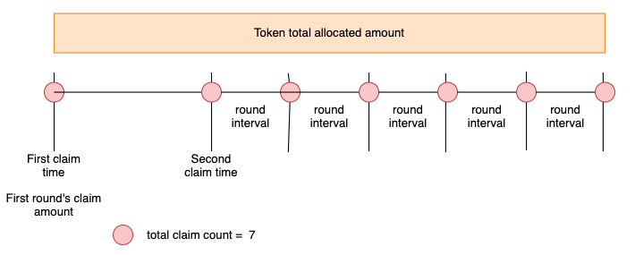

#### Storage

```jsx
address public l2ProjectManager;   // L2 Project Manager Address

// l2token - VaultInfo
mapping(address => LibScheduleVault.VaultInfo) public vaultInfo; // Manage vault information by token address.

// l2token - tokenOwner
mapping(address => address) public vaultAdminOfToken;  // Manage vault admins by token address.LibProject
```

- LibScheduleVault

  ```jsx
  library LibScheduleVault {

      struct VaultInfo {
          address claimer;
          uint256 totalAllocatedAmount;   // Token allocation amount
          uint256 totalClaimCount;        // total number of claims
          uint256 totalClaimedAmount;     // Total amount claimed
          uint256 firstClaimAmount;       // first claim amount
          uint32 firstClaimTime;          // first claim time
          uint32 secondClaimTime;         // second claim time
          uint32 roundInterval;    // round interval (seconds)
          uint32 latestClaimedRound;      // the latest claimed round
      }
  }
  ```

- LibProject

```jsx
struct InitalParameterScheduleVault {
        address claimer;
        uint256 totalAllocatedAmount;
        uint256 totalClaimCount;
        uint256 firstClaimAmount;
        uint32 firstClaimTime;
        uint32 secondClaimTime;
        uint32 roundIntervalTime;
    }
```


#### Events

```jsx
event SetVaultAdmin(address l2Token, address newAdmin);

event InitializedL2ScheduleVault(
        address l2Token,
        string name,
        LibProject.InitalParameterScheduleVault parmas
    );
event ClaimedInVault(address l2Token, string name, address to, uint256 amount);
event ChangedClaimer(address l2Token, string name, address newClaimer);
```


#### Functions

- setL2ProjectManager

  - L2ProjectManager Address setting: setL2ProjectManager
    - parameters : _l2ProjectManager  Address
  - Only admins can set it.

- setVaultAdmin

  - Vault manager setup function : setVaultAdmin
    - parameters : l2Token address, _newAdmin address
  - **Only L2ProjectManager** can set it.

- changeClaimer

  - change the claimer
    - parameter :
    - **only L2ProjectManagerOrVaultAdmin**  **can set it.**

- initialize

  - **Initializer or VaultAdmin** can set it.

  - Setting value initialization function : initialize

    - parameters :  Total Token Allocated Amount, Total Number of Claims, First Claim Amount, First claim time, Second claim time, round interval (seconds)

    - It is a function that cannot be called again after setting it once.

    - Inside this initialize function,

      transfer l2Token from l2ProjectManager to the current vault by totalAllocatedAmount.

      - l2Token.transferFrom(l2ProjectManager, address(this), totalAllocatedAmount)

    - The time of the first claim must be in the future.

    - The values of totalAllocatedAmount, totalClaimCount and roundInterval cannot be zero.

    ```jsx
    function initialize(
            address l2Token,
            string memory vaultName,
            LibProject.InitalParameterScheduleVault memory params
        ) external

    event InitializedL2ScheduleVault(
                address l2Token,
                string name,
                LibProject.InitalParameterScheduleVault parmas
            );
    ```

- **getCurrentRound**

  - View current claim round  :

    getCurrentRound

    ()

    - Current Claim Round = (Current Time - First Claim Time ) / Claim Interval
      - If you have not yet made a claim, and the first claim time has passed and the second claim time has not yet passed,
        - Current Claim Round  : 1
        - latestClaimedRound (in storage): 0 → After making a claim, it changes to 1.

- **availableClaimAmount**

  - Query the amount of tokens you can receive by making a current claim :

    availableClaimAmount

    - Amount of Tokens You Can Receive by Claiming Current
      - latestClaimedRound < Current Claim Round
        - Amount of tokens you can receive by making a current claim = Total amount to be released by the current claim round - Amount already claimed
        - Total amount to be released by the current claim round
          - If the current claim round is 1,
            - the total amount to be released until the current claim round = first round’s claim amount
          - if (1< current claim round < totalClaimCount) ,
            - Total amount to be released by current claim round =  first round’s claim amount + (total allocation amount of tokens - first round’s claim amount) / (totalClaimCount - 1) * (current claim round - 1)
          - If the current claim round is equal to the total number of claims,
            - the total amount to be released until the current claim round = total token allocation amount

- claim

  - parameters : address l2Token, string memory vaultName
  - anybody can execute the claim function. claim amount transfer to claimer.

  ```jsx
  function claim(address l2Token, string memory vaultName )
          external onlyVaultAdminOfToken(l2Token)

  emit ClaimedInVault(l2Token, vaultName, info.claimer, amount);
  ```


### L2InitialLiquidityVault

- A vault that creates a pool of “tos-project tokens” on Uniswap V3 and increase liquidity.

- Transfer project tokens, set start time and price at initialization.

- After the start time, anyone can create a pool and mint/increase liquidity.

  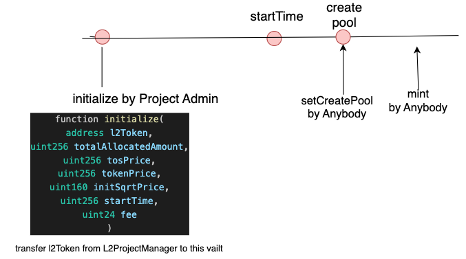

#### Storage

```jsx
struct PoolInfo {
      address pool;
      uint256 totalAllocatedAmount;
      uint256 initialTosPrice;
      uint256 initialTokenPrice;
      uint256 lpToken;
      uint32 startTime;
      uint160 initSqrtPriceX96;
      uint24  fee;
      bool boolReadyToCreatePool;
  }

address public l2ProjectManager;   // L2 Project Manager Address


// l2token - tokenOwner
mapping(address => address) public vaultAdminOfToken;  // Manage vault admins by token address.

address public ton;  //  ton token
address public tos;  //  tos token

address public uniswapV3Factory;
address public nonfungiblePositionManager;
uint32 public TWAP_PERIOD;
int24 public acceptTickChangeInterval;
int24 public acceptSlippagePrice;
int24 public tickSpacings ;

// l2token - PoolInfo
mapping(address => LibInitialLiquidityVault.PoolInfo) public poolInfo;
```

#### Events

```jsx
event SetVaultAdmin(address l2Token, address newAdmin);

event SetUniswapInfo(address _factory, address _npm, address _ton, address _tos);
event SetStartTime(address l2Token, uint256 startTime);

event SetPoolInitialized(address l2Token, address pool, uint160 inSqrtPriceX96);

event SetCreatedPool(address l2Token, address pool);

event InitializedInitialLiquidityVault(
    address l2Token,
    uint256 totalAllocatedAmount,
    uint256 initialTosPrice,
    uint256 initialTokenPrice,
    uint32 startTime,
    uint160 initSqrtPriceX96,
    uint24 fee
);

event IncreasedLiquidityInVault(uint256 indexed tokenId, uint128 liquidity, uint256 amount0, uint256 amount1);

event InitialMintedInVault(
    address l2Token,
    address pool,
    uint256 tokenId,
    uint128 liquidity,
    uint256 amount0,
    uint256 amount1
);
```

#### Functions

- setL2ProjectManager

  - Only admins can set it.
  - L2ProjectManager Address setting: setL2ProjectManager
    - parameters : _l2ProjectManager  Address
    -

- setVaultAdmin

  - Only L2ProjectManager can set it.
  - Vault manager setup function : setVaultAdmin
    - parameters : l2Token address, _newAdmin address
    -

- initialize

  ```solidity
  function initialize(
          address l2Token,
          LibProject.InitalParameterInitialLiquidityVault memory params
      )
          external onlyL2ProjectManagerOrVaultAdmin(l2Token) afterSetUniswap
  ```

  - **Initializer or VaultAdmin** can set it.

  - Setting value initialization function : initialize

    - parameters :  l2Token, totalAllocatedAmount, tos price, token price, initSqrtPrice, startTime, fee
    - It is a function that cannot be called again after setting it once.
    - Inside this initialize function, transfer l2Token from l2ProjectManager to the current vault by totalAllocatedAmount.
      - l2Token.transferFrom(l2ProjectManager, address(this), totalAllocatedAmount)
    - The startTime must be in the future.
    - The values of totalAllocatedAmount, initSqrtPriceX96 and tos price and  token price and fee cannot be zero.

  - LibProject.InitalParameterInitialLiquidityVault

    ```jsx
    struct InitalParameterInitialLiquidityVault {
            uint256 totalAllocatedAmount;
            uint256 tosPrice;
            uint256 tokenPrice;
            uint256 initSqrtPrice;
            uint32 startTime;
            uint16 fee;
        }
    ```

- setCreatePool

  - Anyone can execute this function.
  - create ‘tos-l2Token’ pool in uniswap v3 : setCreatePool
    - parameters : address l2Token
    - It is a function that cannot be called again after setting it once.

- mint

  - Anyone can execute this function.
  - increase liquidity on ‘tos-l2Token’ pool of uniswap v3 : mint
    - parameters : address l2Token, uint256 tosAmount
    - At the first liquidity increase, liquidity tokens are minted. From then on, liquidity is increased in the created liquidity token.
    - Liquidity tokens are set across the whole price range.
    - If the difference between the average price of the last 2 minutes and the current price is more than 4.8%, it will not be executed. (The function can be executed only after 2 minutes after creating the pool.)


### LpRewardVault

This is a vault that can give rewards to LP holders of Uniswap V3 Pool.

#### Storage

```jsx
// l2token - pool address - VaultInfo
mapping(address => mapping(address => LibScheduleVault.VaultInfo)) public vaultInfo;

// pool - pool info
mapping(address => LibPool.PoolInfo) public poolInfo;
```

- LibScheduleVault

  - https://github.com/tokamak-network/l2-project-launch/blob/L2PL_airdrop_stos_holder/contracts/libraries/LibScheduleVault.sol

  ```coq
  struct VaultInfo {
          address claimer;
          uint256 totalAllocatedAmount;   // Token allocation amount
          uint256 totalClaimCount;        // total number of claims
          uint256 totalClaimedAmount;     // Total amount claimed
          uint256 firstClaimAmount;       // first claim amount
          uint32 firstClaimTime;          // first claim time
          uint32 secondClaimTime;         // second claim time
          uint32 roundInterval;    // round interval (seconds)
          uint32 latestClaimedRound;      // the latest claimed round
      }
  ```

- LibPool

  ```jsx
  struct PoolInfo {
          address token0;
          address token1;
          uint24 fee;
      }
  ```

#### Event

```jsx
event InitializedL2LpRewardVault(
        address l2Token,
        LibPool.PoolInfo paramPoolInfo,
        LibProject.InitalParameterScheduleVault parmas
    );
event ClaimedInVault(address l2Token, address pool, address to, uint256 amount);
event ChangedRecipient(address _recipient);
```

#### Transaction Functions

- initialize

  - initialize the parameters of this L2LpRewardVault.
  - This function occur an event  InitializedL2LpRewardVault(l2Token, paramPoolInfo, params).

  ```
  function initialize(
          address l2Token,
  				LibPool.PoolInfo memory paramPoolInfo,
          LibProject.InitalParameterScheduleVault memory params
      )
  ```

- claim

  - claim the reward amount.

  - It execute according to given schedule.

  - Anybody can execute when availableClaimAmount is not zero.

  - This function occur  an event ClaimedInVault(l2Token, pool, recipient, amount).

    ```jsx
    function claim(address l2Token, address pool) external
    ```

#### View Functions

- availableClaimAmount

  - get the claim-able amount of l2Token
  - Refer to the availableClaimAmount function in L2Schedulevault.

  ```jsx
  function availableClaimAmount(address l2Token) public view returns (uint256 amount)
  ```

- getCurrentRound

  - get the current round number.

  - Refer to the getCurrentRound function in L2Schedulevault.

    ```jsx
    function getCurrentRound(address l2Token) public view returns (uint256 round)
    ```

- viewVaultInfo

  - get the vault information mapped this L2Token.

    ```jsx
    function viewVaultInfo(address l2Token) external view returns (LibScheduleVault.VaultInfo memory)
    ```


### L2AirdropStosVault

- Vault holds project tokens in order to airdrop project tokens to sTOS holders.

- Claiming means airdropping project tokens to stos holders.

- Vaults that someone can execute the claim function by specific schedule.

  

#### Storage

```coq
// l2token - VaultInfo
mapping(address => LibScheduleVault.VaultInfo) public vaultInfo;
address public dividendPool;
```

- LibScheduleVault

  - https://github.com/tokamak-network/l2-project-launch/blob/L2PL_airdrop_stos_holder/contracts/libraries/LibScheduleVault.sol

  ```coq
  struct VaultInfo {
          address claimer;
          uint256 totalAllocatedAmount;   // Token allocation amount
          uint256 totalClaimCount;        // total number of claims
          uint256 totalClaimedAmount;     // Total amount claimed
          uint256 firstClaimAmount;       // first claim amount
          uint32 firstClaimTime;          // first claim time
          uint32 secondClaimTime;         // second claim time
          uint32 roundInterval;    // round interval (seconds)
          uint32 latestClaimedRound;      // the latest claimed round
      }
  ```

- LibProject

  - https://github.com/tokamak-network/l2-project-launch/blob/L2PL_airdrop_stos_holder/contracts/libraries/LibProject.sol

  ```coq
  struct InitalParameterScheduleVault {
          address claimer;
          uint256 totalAllocatedAmount;
          uint256 totalClaimCount;
          uint256 firstClaimAmount;
          uint32 firstClaimTime;
          uint32 secondClaimTime;
          uint32 roundIntervalTime;
      }
  ```

#### Events

```coq
event InitializedL2AirdropStosVault(
        address l2Token,
        LibProject.InitalParameterScheduleVault parmas
    );

event ClaimedInVault(address l2Token, uint256 amount);
event SetDividendPool(address newDividendPool);
```

#### Transaction Functions

- initialize

  - initialize the parameters of this L2AirdropStosVault.
  - This function occur  an event  InitializedL2AirdropStosVault(l2Token, params).

  ```
  function initialize(
          address l2Token,
          LibProject.InitalParameterScheduleVault memory params
      )
  ```

- claim

  - claim means to distribute l2Token to sTos holders

  - It execute according to given schedule.

  - Anybody can execute when availableClaimAmount is not zero.

  - This function occur an event ClaimedInVault(l2Token, amount)

  ```jsx
    function claim(address l2Token) external
  ```

#### View Functions

- availableClaimAmount

  - get the claim-able amount of l2Token
  - Refer to the availableClaimAmount function in L2Schedulevault.

  ```jsx
  function availableClaimAmount(address l2Token) public view returns (uint256 amount)
  ```

- getCurrentRound

  - get the current round number.

  - Refer to the getCurrentRound function in L2Schedulevault.

    ```jsx
    function getCurrentRound(address l2Token) public view returns (uint256 round)
    ```

- viewVaultInfo

  - get the vault information mapped this L2Token.

  ```jsx
  function viewVaultInfo(address l2Token) external view returns (LibScheduleVault.VaultInfo memory)
  ```


### TonAirdropVault

- Vault holds project tokens in order to airdrop project tokens to ton stakers.
- Claiming means airdropping project tokens to ton stakers.
- Vaults that someone can execute the claim function by specific schedule.

#### Storage

```jsx
// l2token - VaultInfo
mapping(address => LibScheduleVault.VaultInfo) public vaultInfo;
address public dividendPool;
```

#### Events

```jsx
event InitializedL2AirdropTonVault(
        address l2Token,
        LibProject.InitalParameterScheduleVault parmas
    );
event ClaimedInVault(address l2Token, uint256 amount);
event SetDividendPool(address newDividendPool);
```

#### Transaction Functions

- initialize

  - initialize the parameters of this L2AirdropTonVault.
  - This function occur  an event  InitializedL2AirdropTonVault(l2Token, params).

  ```jsx
  function initialize(
          address l2Token,
          LibProject.InitalParameterScheduleVault memory params
      ) external
  ```

- claim

  - claim means to distribute l2Token to TON holders
  - It execute according to given schedule.
  - Anybody can execute when availableClaimAmount is not zero.
  - This function occur  an event ClaimedInVault(l2Token, amount).

  ```jsx
  function claim(address l2Token) external
  ```

#### View Functions

- availableClaimAmount

  - get the claim-able amount of l2Token
  - Refer to the availableClaimAmount function in L2Schedulevault.

  ```jsx
  function availableClaimAmount(address l2Token) public view returns (uint256 amount)
  ```

- getCurrentRound

  - get the current round number.
  - Refer to the getCurrentRound function in L2Schedulevault.

  ```jsx
  function getCurrentRound(address l2Token) public view returns (uint256 round)
  ```

- viewVaultInfo

  - get the vault information mapped this L2Token.

  ```jsx
  function viewVaultInfo(address l2Token) external view returns (LibScheduleVault.VaultInfo memory)
  ```